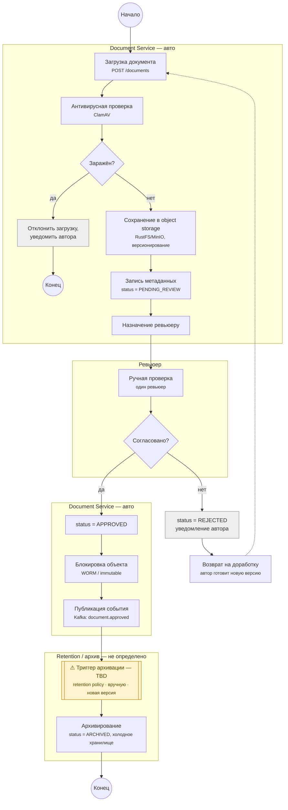

# Жизненный цикл документа: от загрузки до архива

> Диаграмма отражает целевой процесс, реконструированный по бэклогу
> (`backend/tasks`) и `backend/rustfs-evaluation.md`. **В коде
> `document-service` на данный момент (2026-07-14) ни один из этих шагов ещё
> не реализован** — есть только пустой каркас Spring Boot. Диаграмму нужно
> сверить с командой перед тем, как проектировать сущности/эндпоинты.

## Известные и открытые вопросы

| Вопрос | Статус |
|---|---|
| Кто согласовывает документ | Один ревьюер, вручную |
| Что при отклонении | Возврат автору на доработку (новая версия) |
| Триггер архивации | **Не решено** — кандидаты: retention policy / вручную / при загрузке новой версии |

## Диаграмма (UML activity)

## Легенда

- **Прямоугольник** — активность/шаг процесса.
- **Ромб** — точка решения.
- **Жёлтый пунктирный блок** — шаг, чей триггер ещё не определён (TBD).
- **Пунктирная стрелка** (`rework -.-> upload`) — возврат в начало цикла при отклонении документа.

## Что подтверждено, а что предположение

- **Код (2026-07-14):** в `document-service` нет ни одного контроллера, entity
  или Flyway-миграции — только пустой каркас Spring Boot приложения.
- **Из бэклога (`backend/tasks`):** антивирус (ClamAV), object storage с
  версионированием (RustFS/MinIO), Kafka, требование неизменяемости файла
  после approve.
- **Из обсуждения с командой:** согласование выполняет один ревьюер вручную;
  отклонение — возврат автору на доработку; триггер архивации пока не выбран.
- Названия статусов (`PENDING_REVIEW`, `APPROVED`, `REJECTED`, `ARCHIVED`) и
  эндпоинтов предложены для диаграммы и не закреплены в коде — это предмет
  для обсуждения при проектировании сущности `Document`.
